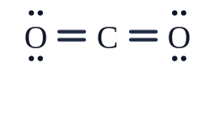
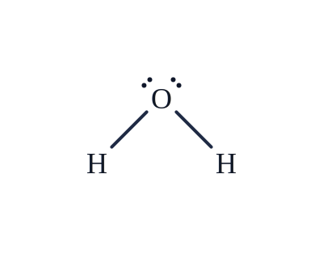
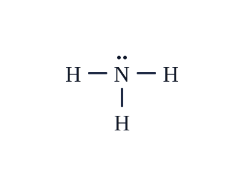
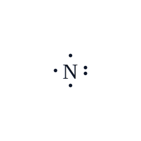
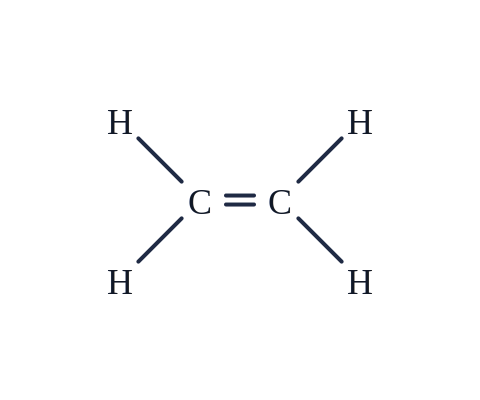
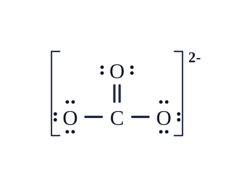

## examples

### CO2

```
C, central, bonds[double-left, double-right]
O, left[C], pairs[top, bottom]
O, right[C], pairs[top, bottom]
```



### H2O

```
O, central, pairs[top-right, top-left]
H, bottom-left[O], bonds[single-top-right]
H, bottom-right[O], bonds[single-top-left]
```



### NH3

```
N, central, pairs[top]
H, left[N], bonds[single-right]
H, bottom[N], bonds[single-top]
H, right[N], bonds[single-left]
```




### N

```
N, central, unpairs[top, bottom, left], pairs[right]
```



### C2H4

```
C, central, bonds[single-top-left, single-bottom-left]
C, right[C1], bonds[single-top-right, single-bottom-right, double-left]
H, top-left[C1]
H, bottom-left[C1]
H, top-right[C2]
H, bottom-right[C2]
```




# CO3^2-

```
#ion[2-]
C, central, bonds[single-left, single-right, double-top]
O, top[C], pairs[right, left]
O, left[C], pairs[top, bottom, left]
O, right[C], pairs[top, bottom, right]
```




# Tetracaine $\ce{C_{15}H_{24}N_{2}O_{2}}$


```
C1, central
C2, right[C1]
C3, right[C2]
N1, right[C3], pairs[bottom]
H, left[C1]
H, top[C1]
H, bottom[C1]
H, top[C2]
H, bottom[C2]
H, top[C3]
H, bottom[C3]
H, top[N1]
C4, right[N1], bonds[double-bottom-right]
C5, top-right[C4], bonds[double-right]
C6, right[C5]
C7, bottom-right[C6]
C8, bottom-right[C4]
C9, right[C8], bonds[double-top-right]
H, top[C5]
H, top[C6]
H, bottom[C8]
H, bottom[C9]
C10, right[C7]
O, top[C10], bonds[double-bottom], pairs[top-left, top-right]
O2, right[C10], pairs[top, bottom]
C11, right[O2]
H, top[C11]
H, bottom[C11]
C12, right[C11]
H, top[C12]
H, bottom[C12]
N2, right[C12], unpairs[top, bottom]
C13, top-right[N2], pairs[top, bottom]
C14, bottom-right[N2], pairs[top, bottom]
H, right[C13]
H, right[C14]
```